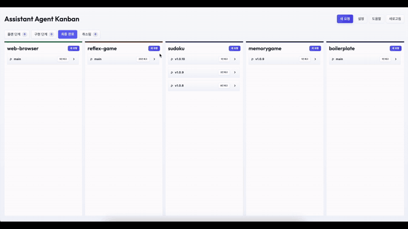
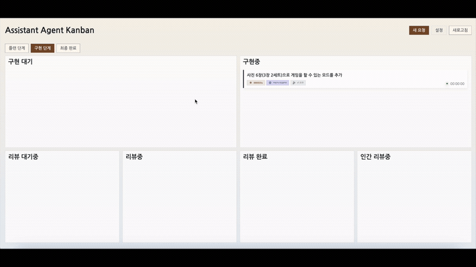
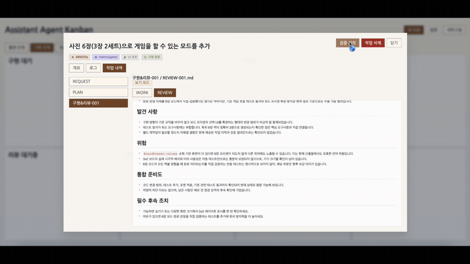

# Assistant Agent Kanban

## English

### Overview

`Assistant Agent Kanban` is a filesystem-backed AI workflow orchestration service. It connects Planner, Implementer, Reviewer, and Committer roles built on top of Antigravity, OpenCode, Codex, Claude, or Gemini CLIs, while explicitly preserving human approval gates where they matter.

The project started from hands-on experiments with AI agent-based development in personal side projects. Terminal-first autonomous loops and Ralph-style iteration were powerful, but they did not map cleanly onto the kind of workflow used in real work: writing requirements, reviewing plans, approving stages, iterating on implementation, and performing final human validation.

That led to the idea behind `Assistant Agent Kanban`: combine an agent-based workflow with a familiar sprint/kanban process, backed by files as durable artifacts and a web UI for visibility.

The current version is best described as a public MVP. The core workflow, dashboard, multi-runtime support, Slack integration, and tests are in place, but it is not yet a fully hardened production system.

### Why I Built This

Coding agent tools such as Claude Code, Codex, OpenCode, and Gemini CLI are improving quickly. Each tool offers its own way to extend workflows through skills, custom commands, subagents, hooks, MCP, or similar mechanisms. Some of these formats are starting to look more portable, but the actual execution model, permissions, state handling, review flow, and human intervention points still differ by tool.

The ranking of agent tools also changes quickly. A workflow that is tightly coupled to one tool can become expensive to move when another runtime becomes a better fit. `Assistant Agent Kanban` treats those tools as execution engines, while keeping the development process, workflow state, approvals, reviews, and human verification outside the individual agent session.

The project also comes from a practical workflow concern: real software work is rarely just “give an agent a goal and wait until the end.” Requirements need to be clarified, plans need to be reviewed, implementations need feedback, review can send work back into another loop, and final verification should happen in the real target repository only when the reviewed result is ready.

In other words, `Assistant Agent Kanban` is not trying to replace coding agents. It is a tool-independent workflow layer for making agent-driven development visible, reviewable, recoverable, and human-governed.

### Demo

Full video: [Watch on YouTube](https://youtu.be/gpdcVGiLxaQ)

**1. Plan**  


**2. Implement & Review**  


**3. Human Verify**  


### Core Goals

- Preserve every stage of work as files and workflow state
- Support AI/human collaboration through a scrum/kanban-style process
- Keep `plan approval -> implement/review loop -> final human verification` explicit
- Go beyond one-off code generation toward a durable development workflow with history and retrospectives
- Evolve from a personal experiment into a reusable open-source tool

### Key Features

- Filesystem-backed state machine with `metadata.json` as the source of truth
- Separate Planner / PlanApproval / Implementer / Reviewer / Committer workers
- Multi-runtime support: Antigravity, OpenCode, Codex, Claude, Gemini — selectable per role
- Per-role backend routing (e.g., `planner: claude`, `implementer: codex`, `reviewer: claude`)
- Per-role model and session token budget configuration
- Isolated `clone-overlay` workspaces
- Automatic plan approval stage with fallback to manual review
- Assistant-first request drafting flow (in-app or from Slack)
- Human verification starts only after review passes
- Target repo patch apply happens only during `completed-reviews -> human-verifying`
- Final commit is created only during `human-verifying -> done`
- Human QA checklist, no-verification-note, and inline-comment gating before final approval
- Reusable target repo summary artifacts and strict summary-driven final commits
- Optional Slack integration: notifications, action buttons, modal flows, file uploads, thread-based request drafting and review loops
- Single-page FastAPI + SSE dashboard with light/dark themes and KO/EN localization
- Retrospective view per task
- Markdown artifacts stored alongside raw JSON outputs
- Both CLI and web UI are supported

### What Problem It Solves

This project is less about “letting AI fix code by itself” and more about making AI work visible, reviewable, and governable by humans.

Its core design principles are:

- workflow state is owned by an external orchestrator
- task directories and real code workspaces remain separate
- only allowed transitions are permitted
- humans verify the result in the real target repo only after AI review passes
- runtime engines (Antigravity/OpenCode/Codex/Claude/Gemini) stay separate from the workflow engine (Python/FastAPI)

### Quick Start

#### 1. Install

```bash
python -m venv .venv
source .venv/bin/activate
pip install -e .[dev]
```

Or use:

```bash
./init.sh
```

On first run, you can point repo discovery at the directory that contains your target repositories:

```bash
./init.sh --root ~/git
```

`./init.sh` will:

- create `.venv`
- run `pip install -e .[dev]`
- initialize a config file when missing
- bootstrap the kanban root and runtime directories

You will additionally need at least one supported CLI installed and authenticated on your machine. The app refuses to start when none of these CLIs are available.

Supported assistant CLIs:

| Assistant | Binary | Official link |
| --- | --- | --- |
| Antigravity CLI | `agy` | [Google Antigravity CLI overview](https://antigravity.google/docs/cli-overview) |
| OpenCode | `opencode` | [OpenCode install docs](https://opencode.ai/docs/#install) |
| Codex CLI | `codex` | [OpenAI Codex CLI quickstart](https://developers.openai.com/codex/quickstart?setup=cli) |
| Claude Code | `claude` | [Anthropic Claude Code native install](https://code.claude.com/docs/en/overview#native-install-recommended) |
| Gemini CLI | `gemini` | [Google Gemini CLI quick install](https://google-gemini.github.io/gemini-cli/#quick-install) |

#### 2. Run the App

Simplest path:

```bash
./run.sh
```

On first run (when `config.local.yaml` does not exist yet), `./run.sh` and `./init.sh` both prompt for:

- a **repo discovery root** (press Enter to keep the default `../`)
- a **default coding assistant** — only CLIs found on `PATH` (from `agy`, `opencode`, `codex`, `gemini`, `claude`) are listed; if exactly one is installed it is auto-selected, and if none are detected the built-in default is kept
- a **UI language** (`EN` / `KO`)
- a **UI theme** (`light` / `dark`)

All answers are written to `config.local.yaml`.

Or set values up front (any combination) and skip the corresponding prompts:

```bash
./run.sh --root ~/git --assistant claude --language KO --theme dark
```

Use `--kanban-root PATH` when you also want the workflow state directory outside this repository.

Direct CLI usage:

```bash
assistant-agent-kanban serve --config ./config.yaml --host 127.0.0.1 --port 8000
```

Direct Uvicorn usage:

```bash
uvicorn assistant_agent_kanban.api.main:app
```

Then open `http://127.0.0.1:8000/` in your browser.

#### 3. Run Tests

```bash
pytest -q
```

### Shortest Usage Flow

1. Create a request (via web UI, CLI, or Slack draft) — produces `REQUEST.md`.
2. The Planner generates `PLAN.md`.
3. The PlanApproval worker (or a human) reviews the plan and moves the task to `todos`.
4. The Implementer works in an isolated workspace and produces `WORK-{n}.md`.
5. The Reviewer produces `REVIEW-{n}.md` and a QA checklist for the human.
6. Once review passes, a human starts verification.
7. After validation in the target repo, approval creates the final commit and summary artifacts, either on a new final branch or on the target branch.

### Architecture Overview

```text
repo-root/
├─ AGENTS.md
├─ .opencode/
│  └─ agents/
│     ├─ fs-kanban-planner.md
│     ├─ fs-kanban-plan-approval.md
│     ├─ fs-kanban-request-draft.md
│     ├─ fs-kanban-implementer.md
│     ├─ fs-kanban-reviewer.md
│     └─ fs-kanban-committer.md
├─ .kanban-agent/
│  ├─ requests/
│  ├─ planning/
│  ├─ plan-approving/
│  ├─ waiting-check-plans/
│  ├─ todos/
│  ├─ implementing/
│  ├─ waiting-reviews/
│  ├─ reviewing/
│  ├─ completed-reviews/
│  ├─ human-verifying/
│  ├─ done/
│  ├─ retrospectives/
│  └─ _runtime/
│     ├─ locks/
│     ├─ workspaces/
│     ├─ runs/
│     ├─ archive-runs/
│     ├─ events/
│     ├─ request-drafts/
│     ├─ request-uploads/
│     └─ board-cache/
└─ src/assistant_agent_kanban/
```

The system has four main layers.

- `task directory`: request/plan/work/review/human-verification docs and `metadata.json`
- `workspace`: isolated code-editing area
- `runtime supervisor`: scanning, transitions, workers, recovery, and optional Slack runtime
- `FastAPI + SSE`: board, task detail, logs, settings, retrospectives, and live updates

### State Machine

States:

- `requests`
- `planning`
- `plan-approving`
- `waiting-check-plans`
- `todos`
- `implementing`
- `waiting-reviews`
- `reviewing`
- `completed-reviews`
- `human-verifying`
- `done`
- `closed`

Main transitions:

```text
requests -> planning
planning -> plan-approving
planning -> waiting-check-plans
planning -> requests
plan-approving -> waiting-check-plans
plan-approving -> todos
waiting-check-plans -> todos
waiting-check-plans -> closed
todos -> implementing
implementing -> waiting-reviews
implementing -> todos
waiting-reviews -> reviewing
reviewing -> completed-reviews
reviewing -> waiting-reviews
reviewing -> todos
completed-reviews -> human-verifying
completed-reviews -> todos
human-verifying -> todos
human-verifying -> done
```

Rules:

- invalid transitions must be blocked in code
- `plan-approving` may auto-promote directly to `todos` when the plan-approval agent approves; otherwise it falls through to `waiting-check-plans` for a human
- if the planner recommends splitting a large request, auto-promotion is blocked and a human can either continue as-is or split into child requests; the parent moves to `closed`
- `completed-reviews` does not mean the target repo is already updated
- patch apply happens only during `completed-reviews -> human-verifying`
- final commit happens only during `human-verifying -> done`
- `closed` is terminal but not a completed implementation or commit

### Worker Roles

- `PlanningWorker` — reads `REQUEST.md` and creates `PLAN.md`
- `PlanApprovalWorker` — evaluates `PLAN.md` against the request and either auto-approves to `todos` or routes to `waiting-check-plans` for a human
- `RequestDraftAgent` — helps a user iterate on a request before submission, from the UI or from a Slack thread
- `ImplementerWorker` — edits code in a workspace and records `WORK-{n}.md`
- `ReviewerWorker` — records review results in `REVIEW-{n}.md`, surfaces endpoint locations, and emits a QA checklist for the human
- `CommitWorker / Human Verification` — handles verification, target repo patch apply, summary artifacts, and the final commit

### Workspace Strategy

The default strategy is `clone-overlay`.

- workspace roots live under `_runtime/workspaces/{task_id}`
- the editable repository checkout lives under `_runtime/workspaces/{task_id}/repo`
- they start from a local clone
- needed ignored/untracked files can be added through overlay copy or symlink
- the target repo is separated from the implementation workspace to reduce contamination
- Codex runs in workspace-write mode; OpenCode/Claude/Gemini treat the target repo as read-only during implementation

### Task Artifacts

- `REQUEST.md`
- `PLAN.md`
- `WORK-{n}.md`
- `REVIEW-{n}.md`
- `HUMAN-QA-{n}.md` — reviewer-provided human QA checklist
- `REVIEWER-QA-{n}.md` — optional human/reviewer Q&A thread
- `HUMAN-VERIFY-{n}.md` — human verification notes and verdict
- `HUMAN-VERIFY-{n}.comments.json` — inline human verification comments
- `COMMIT.md`
- `*.json` raw outputs (per worker run)
- `metadata.json`

Markdown is the human-readable working artifact, while JSON is the raw worker output.
The semantic target repo summary is written during final approval under `target_repo_docs_root/YYYY/MM/DD/{task_id}-{branch-summary}-summary.md`.

### CLI Examples

#### Create a Request

```bash
assistant-agent-kanban request "Refactor login flow" \
  --target-repo /path/to/target-project \
  --kanban-root ./.kanban-agent \
  --base-branch main
```

#### Show Logs

```bash
assistant-agent-kanban logs TASK-0001 --kanban-root ./.kanban-agent
```

#### Run the App

```bash
assistant-agent-kanban serve --config ./config.local.yaml --host 0.0.0.0 --port 8000
```

### Web UI Capabilities

- view the kanban board (with phase tabs and a final/done board view)
- inspect tasks by state, including request drafts
- open task detail modal for metadata, logs, artifacts, and token usage summaries
- read `REQUEST.md`, `PLAN.md`, work/review/human-QA/human-verification documents
- edit and approve `PLAN.md` in supported states
- start / reject / approve human verification (approval is gated on verification apply success, completed/skipped required QA items, no human verification note, and no unresolved inline comments)
- resume planner / implementer / reviewer with explicit choice modals
- delete tasks, including tasks whose target repo is no longer reachable
- create new requests, including assistant-drafted requests
- open the in-app settings modal: assistant selection, per-role backend routing, per-role model and token budget, theme, language
- open the retrospective view per task

### Slack Integration (Optional)

When enabled, the Slack runtime provides:

- thread notifications for state transitions and verification milestones
- action buttons to start verification, approve, request rework, or resume the review loop
- modal flows for review-loop requests and assistant-first request drafting
- markdown artifact uploads to threads (review, plan, summary, completion)
- channel matching by display metadata and pending channel activation tested before adoption

Slack is configured under the `slack:` section of the config file and requires a bot token and (for socket mode) an app token.

### Configuration

By default the app loads `./config.yaml` and overlays `./config.local.yaml` when present. `examples/config.yaml` is a copyable template, not the recommended path to run directly.

Important keys:

- `kanban_root`
- `repo_root`
- `base_branch`
- `target_repo_docs_root`
- `opencode.*` — per-role agent name, model, and session token budget
- `antigravity.*` — `agy` binary, temporary settings path override, autonomy flags, per-role model, and session token budget
- `codex.*` — per-role model and session token budget
- `claude.*` — per-role model and session token budget
- `gemini.*` — per-role model and session token budget
- `workspace.*`
- `locks.*`
- `runtime.*` — `coding_assistant`, `role_backends`, `language`, `theme`, agent counts, auto-dispatch
- `repo_discovery.*`
- `slack.*` (optional)

Antigravity CLI does not currently expose a stable `--model` launch flag. When an `antigravity.*_model` is configured, the adapter temporarily writes that model into Antigravity CLI's settings JSON, starts `agy --print`, keeps the model setting in place for 30 seconds so the CLI can finish startup, and then restores the previous model setting. Concurrent Antigravity startups are serialized during that 30-second window to avoid settings races.

Because Antigravity CLI also does not expose a model discovery command, the dashboard seeds Antigravity model options from the current Antigravity Models settings panel and appends any configured custom model values.

Per-role backend routing example:

```yaml
runtime:
  coding_assistant: opencode
  role_backends:
    planner: claude
    request_draft: opencode
    plan_approval: opencode
    implementer: codex
    reviewer: claude
    commit: opencode
```

### Repository Structure

- `src/assistant_agent_kanban/` — domain, runtime, workers, services, adapters, and API
  - `workers/` — planner, plan-approval, implementer, reviewer, committer
  - `services/` — task, board, human verification, retrospective, plan-approval learning, task deletion
  - `api/` — FastAPI app, routes, SSE, templates (HTML, CSS, modular JS)
  - `*_adapter.py` — Antigravity, OpenCode, Codex, Claude, Gemini adapters
  - `slack_*.py` — Slack runtime, notifications, channel matching, settings tests
- `tests/` — workflow, service, adapter, and API tests
- `.opencode/agents/` — role prompt contracts
- `examples/` — config and bootstrap examples
- `docs/` — architecture, implementation map, and agent brief

Public users can start with `README.md`. Contributors or maintainers should read `AGENTS.md` and `docs/*` as well.

### Python Usage Example

```python
from assistant_agent_kanban.api.app import create_app
from assistant_agent_kanban.assistant_factory import build_role_adapters
from assistant_agent_kanban.config import load_config

config = load_config("examples/config.yaml")
planner, implementer, reviewer, committer, branch_summary = build_role_adapters(config)
app = create_app(config, planner, implementer, reviewer, committer, branch_summary)
```

### Testing And Open-Source Notes

- Run the full test suite with `pytest -q`
- Run lint and type checks with `python -m ruff check .` and `python -m pyright`
- This project emphasizes a reviewable workflow more than raw AI automation
- Human approval stages are intentional and should not be removed
- The target repo should be clean when verification begins
- The full workspace must not live inside the task directory
- Internal CLI state files (Antigravity/OpenCode/Codex/Claude/Gemini) are not the source of truth

### Known Limitations

- This is a public MVP, not a fully hardened production system.
- The web app currently assumes a trusted local environment. Do not expose it directly to the public internet without adding appropriate authentication, authorization, and deployment hardening.
- External agent runtime behavior depends on the installed and authenticated CLI tools on the host machine.
- Slack integration is optional and should be configured carefully because it can trigger workflow actions.
- The largest modules are still candidates for future refactoring as the workflow surface grows.

### Roadmap

- Harden packaging and installation paths for non-editable installs
- Add more deployment guidance and operational safety checks
- Continue improving role-specific runtime support across Antigravity, OpenCode, Codex, Claude, and Gemini
- Split larger service, runtime, API, and frontend modules into smaller maintainable units
- Add more workflow observability around retries, failed runs, and recovery actions

### Contributing

This repository follows a `fork -> branch -> PR` contribution model.

- do not push directly to the main repository
- do not assume contributor branches are created in the upstream repository
- make changes in your fork and submit a Pull Request

See `CONTRIBUTING.md` for details.

### Related Documents

- `AGENTS.md`
- `CONTRIBUTING.md`
- `CODE_OF_CONDUCT.md`
- `SECURITY.md`
- `LICENSE`
- `docs/01-architecture-review.md`
- `docs/02-implementation-plan.md`
- `docs/03-agent-task.md`

---

## 한국어

### 소개

`Assistant Agent Kanban`은 파일시스템 상태를 기반으로 동작하는 AI 작업 오케스트레이션 서비스입니다. Antigravity, OpenCode, Codex, Claude, Gemini CLI 위에서 Planner, Implementer, Reviewer, Committer 역할을 연결하고, 사람 승인 단계가 필요한 구간은 명시적으로 유지합니다.

이 프로젝트는 개인 프로젝트에서 AI Agent 기반 개발을 여러 방식으로 실험한 경험에서 출발했습니다. 터미널 중심의 자율 주행 흐름이나 랄프 스타일의 루프는 강력했지만, 실제 업무처럼 요구사항 작성, 계획 검토, 승인, 구현 반복, 인간 최종 검증까지 이어지는 흐름을 한눈에 추적하기는 어려웠습니다.

그래서 실제 업무에서 익숙하게 사용하던 스프린트/칸반 프로세스를 Agent 개발 흐름과 결합해, 파일 기반 기록과 웹 기반 가시성을 갖춘 도구를 만들어 보자는 목표로 `Assistant Agent Kanban`을 만들게 되었습니다.

현재 버전은 공개 가능한 MVP에 가깝습니다. 핵심 워크플로, 대시보드, 멀티 런타임 지원, Slack 연동, 테스트는 갖추고 있지만 production hardening이나 인증까지 모두 포함한 상태는 아닙니다.

### 왜 만들었는가

Claude Code, Codex, OpenCode, Gemini CLI 같은 coding agent 도구들은 매우 빠르게 발전하고 있습니다. 각 도구는 skills, custom commands, subagents, hooks, MCP 같은 방식으로 workflow를 확장할 수 있게 해주지만, 실제 실행 방식, 권한 모델, 상태 관리, 리뷰 흐름, 사람이 개입하는 타이밍은 여전히 도구마다 다릅니다.

또한 이 영역에서는 도구와 모델의 성능 우위가 빠르게 바뀝니다. 특정 도구의 내부 세션이나 workflow 기능에 개발 프로세스 전체를 강하게 묶어두면, 더 잘 맞는 실행기가 나왔을 때 전환 비용이 커질 수 있습니다. `Assistant Agent Kanban`은 agent 도구를 실행 엔진으로 활용하되, 개발 프로세스와 상태, 승인, 리뷰, 검증 흐름은 도구와 독립적으로 관리하려는 프로젝트입니다.

실제 개발은 단순히 “goal을 주고 끝까지 맡기는 것”만으로 끝나지 않는다고 생각합니다. 처음 요청을 정리하고, 계획을 확인하고, 구현하고, 리뷰하고, 다시 수정하고, 사람이 실제 target repo에서 검증한 뒤 최종 반영하는 과정이 필요합니다.

즉 `Assistant Agent Kanban`은 coding agent를 대체하려는 도구가 아니라, agent 기반 개발을 사람이 볼 수 있고, 검토할 수 있고, 복구할 수 있고, 승인할 수 있는 흐름으로 만들기 위한 도구 독립적인 workflow layer입니다.

### 데모

전체 영상: [Watch on YouTube](https://youtu.be/gpdcVGiLxaQ)

**1. 계획**  


**2. 구현 및 리뷰**  


**3. 사람 검증**  


### 핵심 목표

- 작업의 모든 단계를 파일과 상태로 남기는 개발 흐름
- AI와 사람이 역할을 나눠 협업할 수 있는 스크럼/칸반 기반 프로세스
- `플랜 승인 -> 구현/리뷰 반복 -> 인간 최종 검증` 흐름의 명확한 분리
- 단발성 코드 생성이 아니라, 히스토리와 회고까지 포함한 지속 가능한 개발 도구
- 개인 실험을 넘어 다른 사람도 사용할 수 있는 공개형 오픈소스 도구

### 핵심 특징

- 파일/디렉토리 기반 상태 머신 + `metadata.json`을 source of truth로 사용
- Planner / PlanApproval / Implementer / Reviewer / Committer를 개별 worker로 분리
- 멀티 런타임 지원: Antigravity, OpenCode, Codex, Claude, Gemini — 역할별로 선택 가능
- 역할별 백엔드 라우팅 (예: `planner: claude`, `implementer: codex`, `reviewer: claude`)
- 역할별 모델·세션 토큰 budget 설정 지원
- `clone-overlay` 전략 기반의 격리 workspace 생성
- 자동 plan approval 단계 + 실패 시 사람 검토로 fallback
- Assistant 기반 request drafting 흐름 (웹 UI 또는 Slack에서)
- 리뷰 통과 후에만 human verification 시작 가능
- `completed-reviews -> human-verifying` 시점에만 target repo patch 적용
- 최종 commit은 `human-verifying -> done`에서만 생성
- 사람용 QA 체크리스트, 사람 검증 note 없음, inline comment 해소 기반 최종 승인 게이팅
- 재사용 가능한 target repo summary 산출물과 summary 기반 final commit 정책
- 선택형 Slack 연동: 알림, 액션 버튼, modal flow, 파일 업로드, 스레드 기반 request drafting 및 review loop
- FastAPI + SSE 기반 단일 페이지 대시보드 (라이트/다크 테마, KO/EN 지원)
- task별 회고(retrospective) 화면
- Markdown 산출물과 JSON 원본 결과를 함께 보관
- CLI와 웹 UI 모두 지원

### 어떤 문제를 푸는가

이 프로젝트는 “AI가 알아서 코드를 고친다”보다는 “AI 작업 흐름을 사람이 추적·검토·승인할 수 있게 만든다”에 가깝습니다.

핵심 설계 원칙은 다음과 같습니다.

- 워크플로 상태는 외부 오케스트레이터가 관리한다.
- task 디렉토리와 실제 코드 작업 workspace는 분리한다.
- 허용된 상태 전이만 통과시킨다.
- AI review를 통과한 뒤에만 사람이 실제 target repo에서 검증한다.
- 런타임 엔진(Antigravity/OpenCode/Codex/Claude/Gemini)과 워크플로 엔진(Python/FastAPI)을 분리한다.

### 빠른 시작

#### 1. 설치

```bash
python -m venv .venv
source .venv/bin/activate
pip install -e .[dev]
```

또는:

```bash
./init.sh
```

처음 실행할 때 대상 repository들이 모여 있는 디렉토리를 repo discovery root로 지정할 수 있습니다.

```bash
./init.sh --root ~/git
```

`./init.sh`는 다음을 수행합니다.

- `.venv` 생성
- `pip install -e .[dev]`
- 설정 파일 초기화
- 기본 칸반 루트와 런타임 디렉토리 bootstrap

추가로 지원되는 CLI 중 최소 하나는 설치·인증되어 있어야 합니다. 사용할 수 있는 CLI가 하나도 없으면 앱은 시작되지 않습니다.

지원되는 에이전트 CLI:

| 에이전트 | 실행 파일 | 공식 링크 |
| --- | --- | --- |
| Antigravity CLI | `agy` | [Google Antigravity CLI Overview](https://antigravity.google/docs/cli-overview) |
| OpenCode | `opencode` | [OpenCode 설치 문서](https://opencode.ai/docs/#install) |
| Codex CLI | `codex` | [OpenAI Codex CLI Quickstart](https://developers.openai.com/codex/quickstart?setup=cli) |
| Claude Code | `claude` | [Anthropic Claude Code Native Install](https://code.claude.com/docs/en/overview#native-install-recommended) |
| Gemini CLI | `gemini` | [Google Gemini CLI Quick Install](https://google-gemini.github.io/gemini-cli/#quick-install) |

#### 2. 앱 실행

가장 간단한 실행:

```bash
./run.sh
```

최초 실행 시 (`config.local.yaml`이 아직 없을 때) `./run.sh`와 `./init.sh` 둘 다 다음을 물어봅니다:

- **repo discovery root** (기본값 `../`을 그대로 쓰려면 Enter)
- **기본 coding assistant** — `PATH`에서 찾은 CLI(`agy`, `opencode`, `codex`, `gemini`, `claude`)만 목록에 표시합니다. 하나만 설치되어 있으면 자동 선택되고, 하나도 없으면 기본값을 유지합니다
- **UI 언어** (`EN` / `KO`)
- **UI 테마** (`light` / `dark`)

모든 답변은 `config.local.yaml`에 저장됩니다.

값을 미리 지정하고 해당 프롬프트를 건너뛰려면:

```bash
./run.sh --root ~/git --assistant claude --language KO --theme dark
```

workflow 상태 디렉토리도 이 repository 밖에 두고 싶다면 `--kanban-root PATH`를 사용하세요.

CLI로 직접 실행:

```bash
assistant-agent-kanban serve --config ./config.yaml --host 127.0.0.1 --port 8000
```

Uvicorn 실행:

```bash
uvicorn assistant_agent_kanban.api.main:app
```

브라우저에서 `http://127.0.0.1:8000/` 접속.

#### 3. 테스트

```bash
pytest -q
```

### 가장 짧은 사용 흐름

1. 요청을 생성한다 (웹 UI, CLI, 또는 Slack draft) — `REQUEST.md` 생성.
2. Planner가 `PLAN.md`를 생성한다.
3. PlanApproval worker(또는 사람)이 plan을 검토하고 task를 `todos`로 이동한다.
4. Implementer가 격리된 workspace에서 작업하고 `WORK-{n}.md`를 남긴다.
5. Reviewer가 `REVIEW-{n}.md`와 사람용 QA 체크리스트를 남긴다.
6. 리뷰가 통과되면 사람이 verification을 시작한다.
7. target repo에서 검증 후 approve하면 새 final branch 또는 target branch에 최종 commit과 summary 산출물이 생성된다.

### 아키텍처 개요

```text
repo-root/
├─ AGENTS.md
├─ .opencode/
│  └─ agents/
│     ├─ fs-kanban-planner.md
│     ├─ fs-kanban-plan-approval.md
│     ├─ fs-kanban-request-draft.md
│     ├─ fs-kanban-implementer.md
│     ├─ fs-kanban-reviewer.md
│     └─ fs-kanban-committer.md
├─ .kanban-agent/
│  ├─ requests/
│  ├─ planning/
│  ├─ plan-approving/
│  ├─ waiting-check-plans/
│  ├─ todos/
│  ├─ implementing/
│  ├─ waiting-reviews/
│  ├─ reviewing/
│  ├─ completed-reviews/
│  ├─ human-verifying/
│  ├─ done/
│  ├─ retrospectives/
│  └─ _runtime/
│     ├─ locks/
│     ├─ workspaces/
│     ├─ runs/
│     ├─ archive-runs/
│     ├─ events/
│     ├─ request-drafts/
│     ├─ request-uploads/
│     └─ board-cache/
└─ src/assistant_agent_kanban/
```

구성 요소는 크게 네 층입니다.

- `task directory`: 요청서, 계획서, 구현/리뷰/사람 검증 문서, `metadata.json` 저장
- `workspace`: 실제 코드 수정이 일어나는 격리 작업공간
- `runtime supervisor`: 스캔, 전이, worker 실행, recovery, (선택) Slack runtime
- `FastAPI + SSE`: 보드, 작업 상세, 로그, 설정, 회고, 실시간 업데이트

### 상태 머신

상태 목록:

- `requests`
- `planning`
- `plan-approving`
- `waiting-check-plans`
- `todos`
- `implementing`
- `waiting-reviews`
- `reviewing`
- `completed-reviews`
- `human-verifying`
- `done`
- `closed`

주요 전이:

```text
requests -> planning
planning -> plan-approving
planning -> waiting-check-plans
planning -> requests
plan-approving -> waiting-check-plans
plan-approving -> todos
waiting-check-plans -> todos
waiting-check-plans -> closed
todos -> implementing
implementing -> waiting-reviews
implementing -> todos
waiting-reviews -> reviewing
reviewing -> completed-reviews
reviewing -> waiting-reviews
reviewing -> todos
completed-reviews -> human-verifying
completed-reviews -> todos
human-verifying -> todos
human-verifying -> done
```

규칙:

- 허용되지 않은 전이는 코드에서 차단
- `plan-approving`은 자동 승인 시 `todos`로 직접 promote 가능하고, 그렇지 않으면 `waiting-check-plans`로 fallback
- planner가 큰 요청의 분할을 권장하면 자동 구현 대기로 넘어가지 않고 사람이 원래대로 진행할지, child request로 분할할지 결정하며 parent는 `closed`로 이동
- `completed-reviews`는 target repo 반영 완료 상태가 아님
- patch apply는 `completed-reviews -> human-verifying`에서만 수행
- 최종 commit은 `human-verifying -> done`에서만 수행
- `closed`는 terminal 상태지만 구현 완료나 commit 완료가 아님

### Worker 구성

- `PlanningWorker` — `REQUEST.md`를 읽고 `PLAN.md` 생성
- `PlanApprovalWorker` — 생성된 `PLAN.md`를 요청과 대조해 자동 승인하거나 사람 검토로 라우팅
- `RequestDraftAgent` — UI/Slack 스레드에서 사람과 함께 요청서를 다듬는 역할
- `ImplementerWorker` — workspace에서 코드를 수정하고 `WORK-{n}.md` 기록
- `ReviewerWorker` — `REVIEW-{n}.md` 작성, 엔드포인트 위치 노출, 사람용 QA 체크리스트 생성
- `CommitWorker / Human Verification` — verification, target repo patch apply, summary 산출, final commit 흐름 담당

### Workspace 전략

기본 전략은 `clone-overlay`입니다.

- workspace root는 `_runtime/workspaces/{task_id}` 아래 생성
- 실제 수정 대상 repository checkout은 `_runtime/workspaces/{task_id}/repo` 아래 생성
- local clone 기반으로 준비
- 필요한 ignored/untracked 파일은 overlay copy 또는 symlink로 보강
- target repo와 구현 workspace를 분리해 오염 방지
- Codex는 workspace-write 모드로 실행, OpenCode/Claude/Gemini는 구현 시 target repo를 read-only로 다룸

### Task 산출물

- `REQUEST.md`
- `PLAN.md`
- `WORK-{n}.md`
- `REVIEW-{n}.md`
- `HUMAN-QA-{n}.md` — reviewer가 남기는 사람용 QA 체크리스트
- `REVIEWER-QA-{n}.md` — 선택적 human/reviewer Q&A 스레드
- `HUMAN-VERIFY-{n}.md` — 사람 검증 note와 verdict
- `HUMAN-VERIFY-{n}.comments.json` — 사람 검증 inline comment 상태
- `COMMIT.md`
- `*.json` raw outputs (worker run 단위)
- `metadata.json`

Markdown은 사람이 읽는 working artifact이고, JSON은 worker의 raw output입니다.
semantic target repo summary는 최종 승인 시 `target_repo_docs_root/YYYY/MM/DD/{task_id}-{branch-summary}-summary.md`에 기록됩니다.

### CLI 예시

#### 요청 생성

```bash
assistant-agent-kanban request "로그인 플로우 리팩터링" \
  --target-repo /path/to/target-project \
  --kanban-root ./.kanban-agent \
  --base-branch main
```

#### 로그 확인

```bash
assistant-agent-kanban logs TASK-0001 --kanban-root ./.kanban-agent
```

#### 앱 실행

```bash
assistant-agent-kanban serve --config ./config.local.yaml --host 0.0.0.0 --port 8000
```

### 웹 UI에서 할 수 있는 일

- 칸반 보드 보기 (phase tab, final/done 보드 포함)
- 상태별 task 카드 및 request draft 확인
- task 상세 팝업에서 metadata/로그/문서/토큰 사용량 요약 확인
- `REQUEST.md`, `PLAN.md`, 구현/리뷰/사람 QA/사람 검증 문서 열람
- 특정 상태에서 `PLAN.md` 편집 및 승인
- human verification 시작 / reject / approve (apply 성공, required QA 완료/skip, 사람 검증 note 없음, 미해결 inline comment 없음 기준으로 approve 게이팅)
- planner / implementer / reviewer를 명시적 선택 modal로 resume
- task 삭제 (target repo가 unsafe한 경우도 처리)
- 새 요청 생성 (assistant가 함께 작성)
- 인앱 설정 모달: assistant 선택, 역할별 백엔드 라우팅, 역할별 모델·토큰 budget, 테마, 언어
- task별 회고(retrospective) 화면

### Slack 연동 (선택)

활성화하면 Slack runtime이 다음을 제공합니다.

- 상태 전이와 verification 마일스톤에 대한 thread 알림
- verification 시작/승인/재작업/review loop resume 액션 버튼
- review-loop 요청과 assistant 기반 request drafting을 위한 modal flow
- review/plan/summary/completion markdown 파일 thread 업로드
- channel display metadata 기반 매칭과 테스트 성공 후 채널 활성화

Slack 설정은 config 파일의 `slack:` 섹션에서 관리하며, bot token (필요 시 socket mode용 app token)이 필요합니다.

### 설정

앱은 기본적으로 `./config.yaml`을 읽고 `./config.local.yaml`이 있으면 덮어씁니다. `examples/config.yaml`은 직접 실행용 경로라기보다 복사해서 쓰는 템플릿입니다.

중요한 항목:

- `kanban_root`
- `repo_root`
- `base_branch`
- `target_repo_docs_root`
- `opencode.*` — 역할별 agent 이름, 모델, 세션 토큰 budget
- `antigravity.*` — `agy` binary, 임시 settings path override, 자율 실행 플래그, 역할별 모델, 세션 토큰 budget
- `codex.*` — 역할별 모델, 세션 토큰 budget
- `claude.*` — 역할별 모델, 세션 토큰 budget
- `gemini.*` — 역할별 모델, 세션 토큰 budget
- `workspace.*`
- `locks.*`
- `runtime.*` — `coding_assistant`, `role_backends`, `language`, `theme`, agent count, auto-dispatch
- `repo_discovery.*`
- `slack.*` (선택)

Antigravity CLI는 현재 안정적인 `--model` 실행 플래그를 제공하지 않습니다. `antigravity.*_model`이 설정되어 있으면 어댑터가 Antigravity CLI settings JSON에 모델을 임시로 기록하고 `agy --print`를 시작한 뒤, CLI 초기화가 끝날 수 있도록 30초 동안 유지하고 이전 모델 설정을 복원합니다. 설정 충돌을 막기 위해 Antigravity 시작 구간은 이 30초 동안 직렬화합니다.

Antigravity CLI는 모델 discovery 명령도 제공하지 않기 때문에, 대시보드는 현재 Antigravity Models 설정 패널의 모델 목록을 기본 후보로 보여주고 설정 파일이나 직접 입력으로 저장된 커스텀 모델 값을 뒤에 추가합니다.

역할별 백엔드 라우팅 예시:

```yaml
runtime:
  coding_assistant: opencode
  role_backends:
    planner: claude
    request_draft: opencode
    plan_approval: opencode
    implementer: codex
    reviewer: claude
    commit: opencode
```

### 저장소 구조

- `src/assistant_agent_kanban/` — domain, runtime, worker, service, adapter, API
  - `workers/` — planner, plan-approval, implementer, reviewer, committer
  - `services/` — task, board, human verification, retrospective, plan-approval learning, task deletion
  - `api/` — FastAPI app, route, SSE, template (HTML, CSS, 분리된 JS)
  - `*_adapter.py` — Antigravity, OpenCode, Codex, Claude, Gemini adapter
  - `slack_*.py` — Slack runtime, 알림, 채널 매칭, 설정 테스트
- `tests/` — workflow, service, adapter, API 테스트
- `.opencode/agents/` — 역할별 프롬프트 계약
- `examples/` — 설정/bootstrap 예제
- `docs/` — architecture, implementation map, agent brief

공개 사용자는 `README.md`를 먼저 읽으면 되고, 저장소를 수정하거나 agent 동작 규칙을 이해하려면 `AGENTS.md`와 `docs/*`를 함께 보는 것을 권장합니다.

### Python 사용 예시

```python
from assistant_agent_kanban.api.app import create_app
from assistant_agent_kanban.assistant_factory import build_role_adapters
from assistant_agent_kanban.config import load_config

config = load_config("examples/config.yaml")
planner, implementer, reviewer, committer, branch_summary = build_role_adapters(config)
app = create_app(config, planner, implementer, reviewer, committer, branch_summary)
```

### 테스트와 공개 운영 메모

- 전체 테스트는 `pytest -q`
- lint와 type check는 `python -m ruff check .`, `python -m pyright`로 실행
- 이 프로젝트는 “AI 자동화”보다 “검토 가능한 워크플로”에 무게를 둡니다.
- 사람이 개입하는 승인 단계는 의도적으로 제거하지 않았습니다.
- target repo는 verification 시점에 clean 상태여야 합니다.
- task 디렉토리 안에 전체 workspace를 두지 않습니다.
- CLI(Antigravity/OpenCode/Codex/Claude/Gemini) 내부 상태 파일은 source of truth로 사용하지 않습니다.

### 현재 한계

- 현재 버전은 공개 가능한 MVP이며, production hardening이 모두 끝난 제품은 아닙니다.
- 웹 앱은 신뢰할 수 있는 로컬 환경을 전제로 합니다. 인증, 권한, 배포 보강 없이 public internet에 바로 노출하지 않는 것을 권장합니다.
- 외부 agent runtime 동작은 호스트에 설치되고 인증된 CLI 도구 상태에 영향을 받습니다.
- Slack 연동은 선택 기능이며 workflow action을 실행할 수 있으므로 신중하게 설정해야 합니다.
- 큰 service, runtime, API, frontend 모듈은 장기 유지보수를 위해 추후 리팩토링 대상입니다.

### 로드맵

- editable install이 아닌 일반 설치 환경에서도 안정적으로 동작하도록 packaging 경로 보강
- 배포 가이드와 운영 안전장치 강화
- Antigravity, OpenCode, Codex, Claude, Gemini에 대한 역할별 runtime 지원 개선
- 큰 service, runtime, API, frontend 모듈을 더 작은 단위로 분리
- retry, 실패한 run, recovery action에 대한 workflow observability 강화

### 기여 안내

이 저장소는 `fork -> branch -> PR` 방식의 기여를 전제로 합니다.

- 원본 저장소에 직접 push하지 않습니다.
- contributor 브랜치를 원본 저장소에 직접 만드는 흐름을 기본으로 사용하지 않습니다.
- 외부 기여는 fork에서 작업한 뒤 Pull Request로 제안해 주세요.

자세한 내용은 `CONTRIBUTING.md`를 참고해 주세요.

### 관련 문서

- `AGENTS.md`
- `CONTRIBUTING.md`
- `CODE_OF_CONDUCT.md`
- `SECURITY.md`
- `LICENSE`
- `docs/01-architecture-review.md`
- `docs/02-implementation-plan.md`
- `docs/03-agent-task.md`
