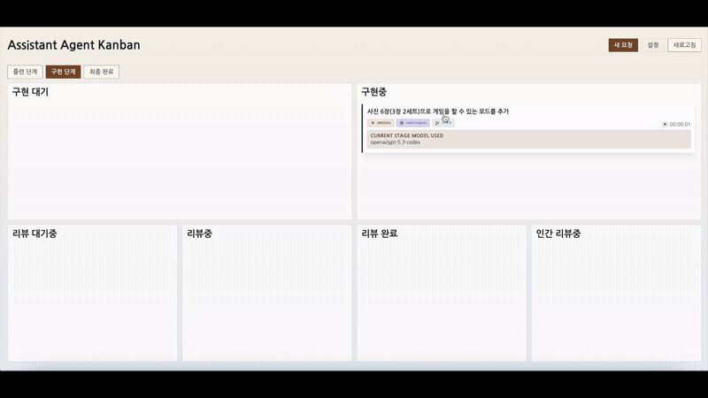
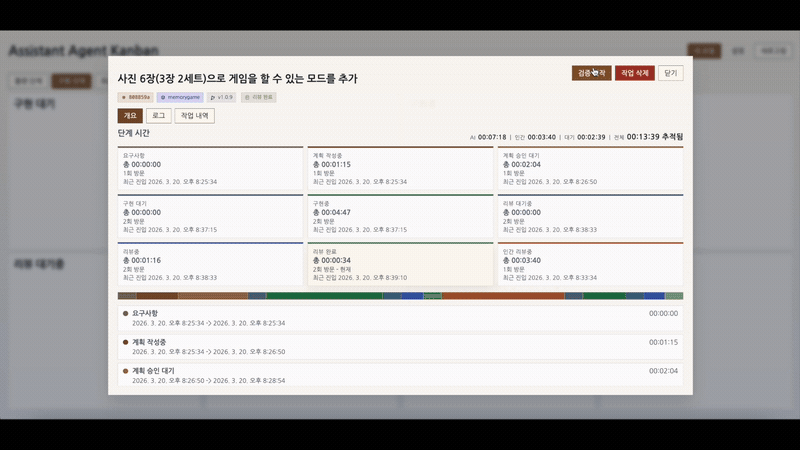

# Assistant Agent Kanban

## English

### Overview

`Assistant Agent Kanban` is a filesystem-backed AI workflow orchestration service. It connects Planner, Implementer, Reviewer, and Committer roles built on top of OpenCode or Codex CLI, while explicitly preserving human approval gates where they matter.

The project started from hands-on experiments with AI agent-based development in personal side projects. Terminal-first autonomous loops and Ralph-style iteration were powerful, but they did not map cleanly onto the kind of workflow used in real work: writing requirements, reviewing plans, approving stages, iterating on implementation, and performing final human validation.

That led to the idea behind `Assistant Agent Kanban`: combine an OpenCode-based agent workflow with a familiar sprint/kanban process, backed by files as durable artifacts and a web UI for visibility.

The current version is best described as a public MVP. The core workflow, dashboard, and tests are in place, but it is not yet a fully hardened production system.

### Demo

Full video: [Watch on YouTube](https://youtu.be/gpdcVGiLxaQ)

**1. Plan**  


**2. Implement & Review**  


**3. Human Verify**  


**4. Retry Implement & Review**  


**5. Human Verify & Complete**  


### Core Goals

- Preserve every stage of work as files and workflow state
- Support AI/human collaboration through a scrum/kanban-style process
- Keep `plan approval -> implement/review loop -> final human verification` explicit
- Go beyond one-off code generation toward a durable development workflow with history and retrospectives
- Evolve from a personal experiment into a reusable open-source tool

### Key Features

- Filesystem-backed state machine with `metadata.json` as the source of truth
- Separate Planner / Implementer / Reviewer / Committer workers
- Isolated `clone-overlay` workspaces
- Human verification starts only after review passes
- Target repo patch apply happens only during `completed-reviews -> human-verifying`
- Final commit is created only during `human-verifying -> done`
- Single-page FastAPI + SSE dashboard
- Markdown artifacts stored alongside raw JSON outputs
- Both CLI and web UI are supported

### What Problem It Solves

This project is less about “letting AI fix code by itself” and more about making AI work visible, reviewable, and governable by humans.

Its core design principles are:

- workflow state is owned by an external orchestrator
- task directories and real code workspaces remain separate
- only allowed transitions are permitted
- humans verify the result in the real target repo only after AI review passes
- runtime engines (OpenCode/Codex) stay separate from the workflow engine (Python/FastAPI)

### Quick Start

#### 1. Install

```bash
python -m venv .venv
source .venv/bin/activate
pip install -e .[dev]
```

Or use:

```bash
./init.sh
```

`./init.sh` will:

- create `.venv`
- run `pip install -e .[dev]`
- initialize a config file when missing
- bootstrap the kanban root and runtime directories

#### 2. Run the App

Simplest path:

```bash
./run.sh
```

Direct CLI usage:

```bash
assistant-agent-kanban serve --config ./examples/config.yaml --host 127.0.0.1 --port 8000
```

Direct Uvicorn usage:

```bash
uvicorn assistant_agent_kanban.api.main:app
```

Then open `http://127.0.0.1:8000/` in your browser.

#### 3. Run Tests

```bash
pytest -q
```

### Shortest Usage Flow

1. Create `REQUEST.md`.
2. The Planner generates `PLAN.md`.
3. A human reviews the plan and moves the task to `todos`.
4. The Implementer works in an isolated workspace and produces `WORK-{n}.md`.
5. The Reviewer produces `REVIEW-{n}.md`.
6. Once review passes, a human starts verification.
7. After validation in the target repo, approval creates the final commit.

### Architecture Overview

```text
repo-root/
├─ AGENTS.md
├─ .opencode/
│  └─ agents/
├─ .kanban-agent/
│  ├─ requests/
│  ├─ planning/
│  ├─ waiting-check-plans/
│  ├─ todos/
│  ├─ implementing/
│  ├─ waiting-reviews/
│  ├─ reviewing/
│  ├─ completed-reviews/
│  ├─ human-verifying/
│  ├─ done/
│  └─ _runtime/
│     ├─ locks/
│     ├─ workspaces/
│     ├─ runs/
│     └─ events/
└─ src/assistant_agent_kanban/
```

The system has four main layers.

- `task directory`: request/plan/work/review docs and `metadata.json`
- `workspace`: isolated code-editing area
- `runtime supervisor`: scanning, transitions, workers, recovery
- `FastAPI + SSE`: board, task detail, logs, and live updates

### State Machine

States:

- `requests`
- `planning`
- `waiting-check-plans`
- `todos`
- `implementing`
- `waiting-reviews`
- `reviewing`
- `completed-reviews`
- `human-verifying`
- `done`

Main transitions:

```text
requests -> planning
planning -> waiting-check-plans
waiting-check-plans -> todos
todos -> implementing
implementing -> waiting-reviews
implementing -> todos
waiting-reviews -> reviewing
reviewing -> completed-reviews
reviewing -> todos
completed-reviews -> human-verifying
human-verifying -> todos
human-verifying -> done
```

Rules:

- invalid transitions must be blocked in code
- `completed-reviews` does not mean the target repo is already updated
- patch apply happens only during `completed-reviews -> human-verifying`
- final commit happens only during `human-verifying -> done`

### Worker Roles

- `PlanningWorker` — reads `REQUEST.md` and creates `PLAN.md`
- `ImplementerWorker` — edits code in a workspace and records `WORK-{n}.md`
- `ReviewerWorker` — records review results in `REVIEW-{n}.md`
- `CommitWorker / Human Verification` — handles verification and final commit flow

### Workspace Strategy

The default strategy is `clone-overlay`.

- workspaces live under `_runtime/workspaces/{task_id}`
- they start from a local clone
- needed ignored/untracked files can be added through overlay copy or symlink
- the target repo is separated from the implementation workspace to reduce contamination

### Task Artifacts

- `REQUEST.md`
- `PLAN.md`
- `WORK-{n}.md`
- `REVIEW-{n}.md`
- `COMMIT.md`
- `*.json` raw outputs
- `metadata.json`

Markdown is the human-readable working artifact, while JSON is the raw worker output.

### CLI Examples

#### Create a Request

```bash
assistant-agent-kanban request "Refactor login flow" \
  --target-repo /path/to/target-project \
  --kanban-root ./.kanban-agent \
  --base-branch main
```

#### Show Logs

```bash
assistant-agent-kanban logs TASK-0001 --kanban-root ./.kanban-agent
```

#### Run the App

```bash
assistant-agent-kanban serve --config ./config.local.yaml --host 0.0.0.0 --port 8000
```

### Web UI Capabilities

- view the kanban board
- inspect tasks by state
- open task detail modal for metadata, logs, and artifacts
- read `REQUEST.md`, `PLAN.md`, work/review documents
- edit and approve `PLAN.md` in supported states
- start / reject / approve human verification
- create new requests

### Configuration

The default config file is `examples/config.yaml`.

Important keys:

- `kanban_root`
- `repo_root`
- `base_branch`
- `opencode.*`
- `codex.*`
- `workspace.*`
- `locks.*`
- `runtime.*`
- `repo_discovery.*`

### Repository Structure

- `src/assistant_agent_kanban/` — domain, runtime, workers, and API
- `tests/` — workflow, service, and API tests
- `.opencode/agents/` — role prompt contracts
- `examples/` — config and bootstrap examples
- `docs/` — architecture, implementation map, and agent brief

Public users can start with `README.md`. Contributors or maintainers should read `AGENTS.md` and `docs/*` as well.

### Python Usage Example

```python
from assistant_agent_kanban.api.app import create_app
from assistant_agent_kanban.assistant_factory import build_role_adapters
from assistant_agent_kanban.config import load_config

config = load_config("examples/config.yaml")
planner, implementer, reviewer, committer, branch_summary = build_role_adapters(config)
app = create_app(config, planner, implementer, reviewer, committer, branch_summary)
```

### Testing And Open-Source Notes

- Run the full test suite with `pytest -q`
- This project emphasizes a reviewable workflow more than raw AI automation
- Human approval stages are intentional and should not be removed
- The target repo should be clean when verification begins
- The full workspace must not live inside the task directory
- OpenCode/oh-my-opencode internal state files are not the source of truth

### Contributing

This repository follows a `fork -> branch -> PR` contribution model.

- do not push directly to the main repository
- do not assume contributor branches are created in the upstream repository
- make changes in your fork and submit a Pull Request

See `CONTRIBUTING.md` for details.

### Related Documents

- `AGENTS.md`
- `CONTRIBUTING.md`
- `CODE_OF_CONDUCT.md`
- `SECURITY.md`
- `LICENSE`
- `docs/01-architecture-review.md`
- `docs/02-implementation-plan.md`
- `docs/03-agent-task.md`

---

## 한국어

### 소개

`Assistant Agent Kanban`은 파일시스템 상태를 기반으로 동작하는 AI 작업 오케스트레이션 서비스입니다. OpenCode 또는 Codex CLI 기반의 Planner, Implementer, Reviewer, Committer 역할을 연결하고, 사람 승인 단계가 필요한 구간은 명시적으로 유지합니다.

이 프로젝트는 개인 프로젝트에서 AI Agent 기반 개발을 여러 방식으로 실험한 경험에서 출발했습니다. 터미널 중심의 자율 주행 흐름이나 랄프 스타일의 루프는 강력했지만, 실제 업무처럼 요구사항 작성, 계획 검토, 승인, 구현 반복, 인간 최종 검증까지 이어지는 흐름을 한눈에 추적하기는 어려웠습니다.

그래서 실제 업무에서 익숙하게 사용하던 스프린트/칸반 프로세스를 OpenCode 기반 Agent 개발 흐름과 결합해, 파일 기반 기록과 웹 기반 가시성을 갖춘 도구를 만들어 보자는 목표로 `Assistant Agent Kanban`을 만들게 되었습니다.

현재 버전은 공개 가능한 MVP에 가깝습니다. 핵심 워크플로, 대시보드, 테스트는 갖추고 있지만 production hardening이나 인증까지 모두 포함한 상태는 아닙니다.

### 데모

전체 영상: [Watch on YouTube](https://youtu.be/gpdcVGiLxaQ)

**1. 계획**  


**2. 구현 및 리뷰**  


**3. 사람 검증**  


**4. 재요청 구현 및 리뷰**  


**5. 사람 검증 및 완료**  


### 핵심 목표

- 작업의 모든 단계를 파일과 상태로 남기는 개발 흐름
- AI와 사람이 역할을 나눠 협업할 수 있는 스크럼/칸반 기반 프로세스
- `플랜 승인 -> 구현/리뷰 반복 -> 인간 최종 검증` 흐름의 명확한 분리
- 단발성 코드 생성이 아니라, 히스토리와 회고까지 포함한 지속 가능한 개발 도구
- 개인 실험을 넘어 다른 사람도 사용할 수 있는 공개형 오픈소스 도구

### 핵심 특징

- 파일/디렉토리 기반 상태 머신 + `metadata.json`을 source of truth로 사용
- Planner / Implementer / Reviewer / Committer 역할을 개별 worker로 분리
- `clone-overlay` 전략 기반의 격리 workspace 생성
- 리뷰 통과 후에만 human verification 시작 가능
- `completed-reviews -> human-verifying` 시점에만 target repo patch 적용
- 최종 commit은 `human-verifying -> done`에서만 생성
- FastAPI + SSE 기반 단일 페이지 대시보드 제공
- Markdown 산출물과 JSON 원본 결과를 함께 보관
- CLI와 웹 UI 모두 지원

### 어떤 문제를 푸는가

이 프로젝트는 “AI가 알아서 코드를 고친다”보다는 “AI 작업 흐름을 사람이 추적·검토·승인할 수 있게 만든다”에 가깝습니다.

핵심 설계 원칙은 다음과 같습니다.

- 워크플로 상태는 외부 오케스트레이터가 관리한다.
- task 디렉토리와 실제 코드 작업 workspace는 분리한다.
- 허용된 상태 전이만 통과시킨다.
- AI review를 통과한 뒤에만 사람이 실제 target repo에서 검증한다.
- 런타임 엔진(OpenCode/Codex)과 워크플로 엔진(Python/FastAPI)을 분리한다.

### 빠른 시작

#### 1. 설치

```bash
python -m venv .venv
source .venv/bin/activate
pip install -e .[dev]
```

또는:

```bash
./init.sh
```

`./init.sh`는 다음을 수행합니다.

- `.venv` 생성
- `pip install -e .[dev]`
- 설정 파일 초기화
- 기본 칸반 루트와 런타임 디렉토리 bootstrap

#### 2. 앱 실행

가장 간단한 실행:

```bash
./run.sh
```

CLI로 직접 실행:

```bash
assistant-agent-kanban serve --config ./examples/config.yaml --host 127.0.0.1 --port 8000
```

Uvicorn 실행:

```bash
uvicorn assistant_agent_kanban.api.main:app
```

브라우저에서 `http://127.0.0.1:8000/` 접속.

#### 3. 테스트

```bash
pytest -q
```

### 가장 짧은 사용 흐름

1. `REQUEST.md`를 만든다.
2. Planner가 `PLAN.md`를 생성한다.
3. 사람이 plan을 검토하고 task를 `todos`로 이동한다.
4. Implementer가 격리된 workspace에서 작업하고 `WORK-{n}.md`를 남긴다.
5. Reviewer가 `REVIEW-{n}.md`를 남긴다.
6. 리뷰가 통과되면 사람이 verification을 시작한다.
7. target repo에서 검증 후 approve하면 최종 commit이 생성된다.

### 아키텍처 개요

```text
repo-root/
├─ AGENTS.md
├─ .opencode/
│  └─ agents/
├─ .kanban-agent/
│  ├─ requests/
│  ├─ planning/
│  ├─ waiting-check-plans/
│  ├─ todos/
│  ├─ implementing/
│  ├─ waiting-reviews/
│  ├─ reviewing/
│  ├─ completed-reviews/
│  ├─ human-verifying/
│  ├─ done/
│  └─ _runtime/
│     ├─ locks/
│     ├─ workspaces/
│     ├─ runs/
│     └─ events/
└─ src/assistant_agent_kanban/
```

구성 요소는 크게 네 층입니다.

- `task directory`: 요청서, 계획서, 구현/리뷰 결과, `metadata.json` 저장
- `workspace`: 실제 코드 수정이 일어나는 격리 작업공간
- `runtime supervisor`: 스캔, 전이, worker 실행, recovery 담당
- `FastAPI + SSE`: 보드, 작업 상세, 로그, 실시간 업데이트 제공

### 상태 머신

상태 목록:

- `requests`
- `planning`
- `waiting-check-plans`
- `todos`
- `implementing`
- `waiting-reviews`
- `reviewing`
- `completed-reviews`
- `human-verifying`
- `done`

주요 전이:

```text
requests -> planning
planning -> waiting-check-plans
waiting-check-plans -> todos
todos -> implementing
implementing -> waiting-reviews
implementing -> todos
waiting-reviews -> reviewing
reviewing -> completed-reviews
reviewing -> todos
completed-reviews -> human-verifying
human-verifying -> todos
human-verifying -> done
```

규칙:

- 허용되지 않은 전이는 코드에서 차단
- `completed-reviews`는 target repo 반영 완료 상태가 아님
- patch apply는 `completed-reviews -> human-verifying` 에서만 수행
- 최종 commit은 `human-verifying -> done` 에서만 수행

### Worker 구성

- `PlanningWorker` — `REQUEST.md`를 읽고 `PLAN.md` 생성
- `ImplementerWorker` — workspace에서 코드를 수정하고 `WORK-{n}.md` 기록
- `ReviewerWorker` — `REVIEW-{n}.md`로 리뷰 결과 기록
- `CommitWorker / Human Verification` — verification과 final commit 흐름 담당

### Workspace 전략

기본 전략은 `clone-overlay`입니다.

- workspace는 `_runtime/workspaces/{task_id}` 아래 생성
- local clone 기반으로 준비
- 필요한 ignored/untracked 파일은 overlay copy 또는 symlink로 보강
- target repo와 구현 workspace를 분리해 오염 방지

### Task 산출물

- `REQUEST.md`
- `PLAN.md`
- `WORK-{n}.md`
- `REVIEW-{n}.md`
- `COMMIT.md`
- `*.json` raw outputs
- `metadata.json`

Markdown은 사람이 읽는 working artifact이고, JSON은 worker의 raw output입니다.

### CLI 예시

#### 요청 생성

```bash
assistant-agent-kanban request "로그인 플로우 리팩터링" \
  --target-repo /path/to/target-project \
  --kanban-root ./.kanban-agent \
  --base-branch main
```

#### 로그 확인

```bash
assistant-agent-kanban logs TASK-0001 --kanban-root ./.kanban-agent
```

#### 앱 실행

```bash
assistant-agent-kanban serve --config ./config.local.yaml --host 0.0.0.0 --port 8000
```

### 웹 UI에서 할 수 있는 일

- 칸반 보드 보기
- 상태별 task 카드 확인
- task 상세 팝업에서 metadata/로그/문서 확인
- `REQUEST.md`, `PLAN.md`, 구현/리뷰 문서 열람
- 특정 상태에서 `PLAN.md` 편집 및 승인
- human verification 시작 / reject / approve
- 새 요청 생성

### 설정

기본 설정 파일은 `examples/config.yaml`입니다.

중요한 항목:

- `kanban_root`
- `repo_root`
- `base_branch`
- `opencode.*`
- `codex.*`
- `workspace.*`
- `locks.*`
- `runtime.*`
- `repo_discovery.*`

### 저장소 구조

- `src/assistant_agent_kanban/` — domain, runtime, workers, API
- `tests/` — workflow, service, and API tests
- `.opencode/agents/` — role prompt contracts
- `examples/` — config and bootstrap examples
- `docs/` — architecture, implementation map, and agent brief

공개 사용자는 `README.md`를 먼저 읽으면 되고, 저장소를 수정하거나 agent 동작 규칙을 이해하려면 `AGENTS.md`와 `docs/*`를 함께 보는 것을 권장합니다.

### Python 사용 예시

```python
from assistant_agent_kanban.api.app import create_app
from assistant_agent_kanban.assistant_factory import build_role_adapters
from assistant_agent_kanban.config import load_config

config = load_config("examples/config.yaml")
planner, implementer, reviewer, committer, branch_summary = build_role_adapters(config)
app = create_app(config, planner, implementer, reviewer, committer, branch_summary)
```

### 테스트와 공개 운영 메모

- 전체 테스트는 `pytest -q`
- 이 프로젝트는 “AI 자동화”보다 “검토 가능한 워크플로”에 무게를 둡니다.
- 사람이 개입하는 승인 단계는 의도적으로 제거하지 않았습니다.
- target repo는 verification 시점에 clean 상태여야 합니다.
- task 디렉토리 안에 전체 workspace를 두지 않습니다.
- OpenCode/oh-my-opencode 내부 상태 파일을 source of truth로 사용하지 않습니다.

### 기여 안내

이 저장소는 `fork -> branch -> PR` 방식의 기여를 전제로 합니다.

- 원본 저장소에 직접 push하지 않습니다.
- contributor 브랜치를 원본 저장소에 직접 만드는 흐름을 기본으로 사용하지 않습니다.
- 외부 기여는 fork에서 작업한 뒤 Pull Request로 제안해 주세요.

자세한 내용은 `CONTRIBUTING.md`를 참고해 주세요.

### 관련 문서

- `AGENTS.md`
- `CONTRIBUTING.md`
- `CODE_OF_CONDUCT.md`
- `SECURITY.md`
- `LICENSE`
- `docs/01-architecture-review.md`
- `docs/02-implementation-plan.md`
- `docs/03-agent-task.md`
